# **AI COMMUNITY AFRICA**

## **DATA ANALYSIS TRACK** - *Returning Learners - Capstone Project*

# **1. Project Overview**

This capstone project is your opportunity to demonstrate every skill you have built across all five months and all 20 sessions of the programme, from raw data import and Power Query transformation, through data modelling, advanced DAX, statistical EDA, AI-driven visuals, and deployment to the Power BI Service.

You have been hired as a Data Analyst at TradeFlow Nigeria, a fictional FMCG distribution company with operations in Lagos, Abuja, Port Harcourt, Kano, and Ibadan.

The Head of Commercial Analytics has asked you to build an executive-level Retail Sales Performance Dashboard that surfaces revenue trends, product performance, sales-team KPIs, regional insights, and forward-looking analysis — all in a single, interactive Power BI report.

Management needs to make Q3 budget decisions within two weeks. Your dashboard is the primary input.

## **1.1  Why This Project Matters**
This capstone is intentionally designed to mirror a real commercial brief. It tests not only your technical ability, but also your capacity to communicate insights clearly to a non-technical audience. Every skill from every session maps directly to a task you will perform in this project.

# **2. Dataset — Download Links**
Your dataset is a simulated but realistic multi-table collection, designed to replicate the kind of messy, real-world data you will encounter in a Nigerian FMCG business. Download each file individually using the links in the table below, or download the full bundle from the ZIP link provided underneath.

<table>
  <tr>
   <td>
<strong>File Name</strong>
   </td>
   <td>
<strong>Table Type</strong>
   </td>
   <td>
<strong>Format</strong>
   </td>
   <td>
<strong>Download Link</strong>
   </td>
  </tr>
  <tr>
   <td>
<strong>Sales.csv</strong>
   </td>
   <td>
Fact Table — Orders
   </td>
   <td>
<em>CSV</em>
   </td>
   <td>
<a href="Sales.csv">Download Sales.csv</a>
   </td>
  </tr>
  <tr>
   <td>
<strong>Products.csv</strong>
   </td>
   <td>
Dimension — Products
   </td>
   <td>
<em>CSV</em>
   </td>
   <td>
<a href="Products.csv">Download Products.csv</a>
   </td>
  </tr>
  <tr>
   <td>
<strong>Customers.csv</strong>
   </td>
   <td>
Dimension — Customers
   </td>
   <td>
<em>CSV</em>
   </td>
   <td>
<a href="Customers.csv">Download Customers.csv</a>
   </td>
  </tr>
  <tr>
   <td>
<strong>SalesReps.csv</strong>
   </td>
   <td>
Dimension — Sales Reps
   </td>
   <td>
<em>CSV</em>
   </td>
   <td>
<a href="SalesReps.csv">Download SalesReps.csv</a>
   </td>
  </tr>
  <tr>
   <td>
<strong>Targets.csv</strong>
   </td>
   <td>
Reference — Monthly Targets
   </td>
   <td>
<em>CSV</em>
   </td>
   <td>
<a href="Targets.csv">Download Targets.csv</a>
   </td>
  </tr>
  <tr>
   <td>
<strong>TradeFlow_Dataset.zip</strong>
   </td>
   <td>
Full Bundle (all 5 files)
   </td>
   <td>
<em>ZIP</em>
   </td>
   <td>
<a href="TradeFlow_Dataset.zip">Download Full Dataset Bundle</a>
   </td>
  </tr>
</table>

Dataset Contents at a Glance:
`sales.csv` — Order ID, Date, Product ID, Customer ID, Rep ID, Region, Units Sold, Unit Price, Discount %

`products.csv` — Product ID, Product Name, Category, Sub-Category, Cost Price (NGN)

`customers.csv` — Customer ID, Customer Name, Segment, City, State, Region

`salesreps.csv` — Rep ID, Name, Team, Manager, Join Date, Region

`targets.csv` — Month, Region, Sales Target (NGN)

**NOTE**: The data contains intentional quality issues (nulls, wrong types, duplicates, inconsistent spellings) for you to clean using Power Query — this is part of the assessment.

*A Date Dimension table is NOT provided — you must create it yourself using DAX (CALENDAR or CALENDARAUTO) as part of your submission. It must include calculated columns for Year, Month Number, Month Name, Quarter, and Week Number.*

# **3. Project Requirements**
Your completed report must address all five requirement areas below. Every requirement maps to specific sessions as shown in the Topic Coverage Map (Section 3).

## **3.1  Data Preparation & Modelling**
The data was prepared using Power Query and its tools: Column Distribution, Column Quality, and Column Profile.

The data types of the `unit_price_NGN` and `cost_price_NGN` in every table were converted to standard currency fixed decimal numbers. While the extracted `year`, `month_number`, and `month` were converted to whole numbers and text, respectively, for further modeling relationships.

The first row of the `customers` table was promoted to the header. Likewise, the `products`, `sales`, `salesreps`, `targets` tables: 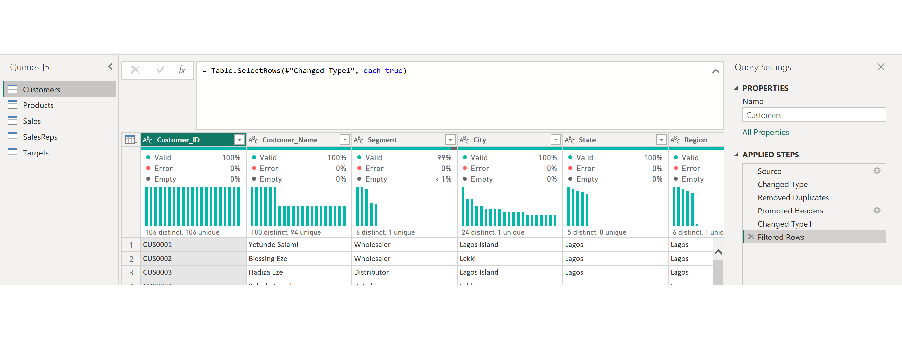

The `customers` table, the `customer_ID` column was analysed by using the `Groupby` method to identify the duplicated ids: 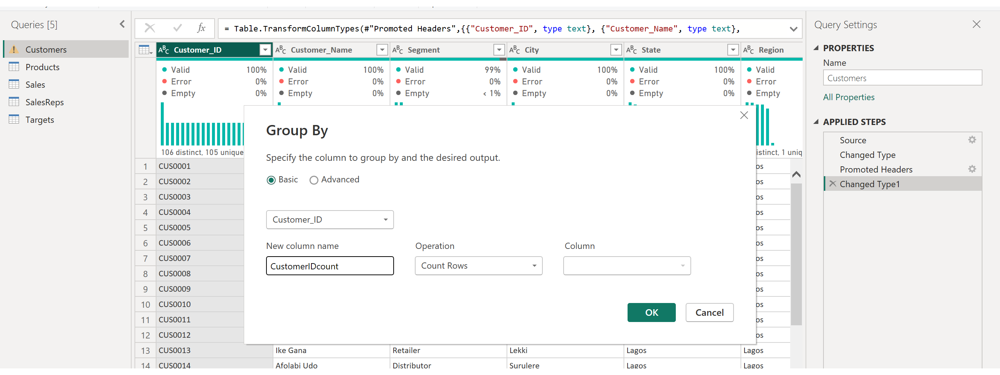 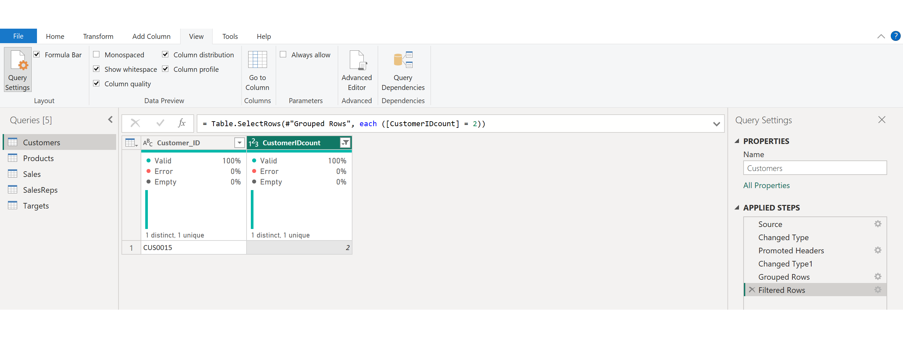 

**Resolution**: Counts greater than 1 show duplication. `CUS0015` was the only duplicate in this column. removed duplicates from the `customer_id` row. The `customers` table, the `segment` column contained &lt; 1% empty string. 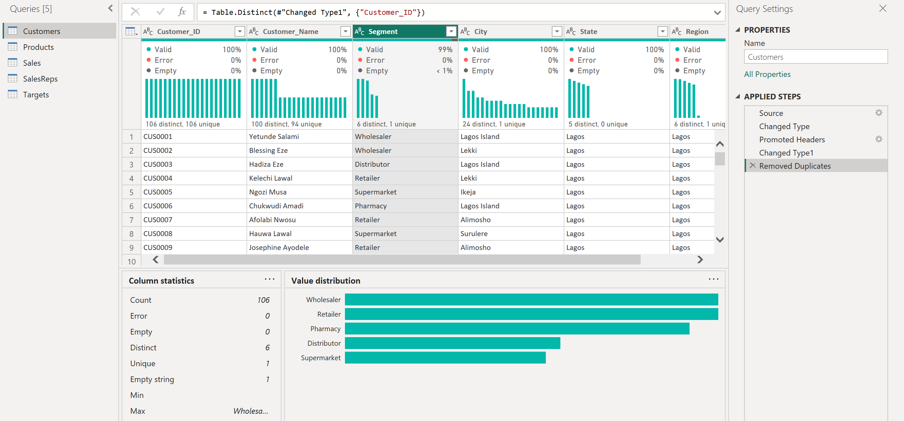

Corresponding to one empty column-row: 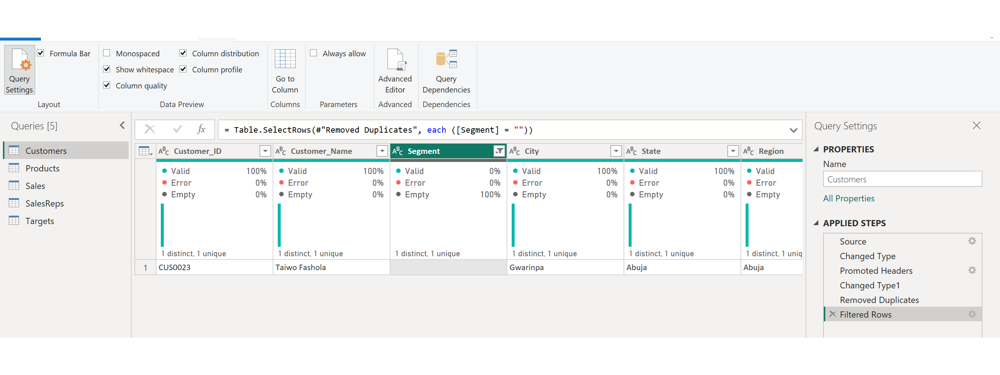 

**Resolution**: Since the `customer_id` follows an incremental count of the customers, removing the rows will only affect further analysis that will be done on the dataset. Moreover, analysing the Customer Name shows that all customers with the same last name have at least one of the following segments: ‘retailer’, ‘wholesaler’, ‘distributor’, ‘supermarket’, ‘pharmacy’, and the last name ’Fashola’ is missing one of the segments - ‘distributor’ and ‘supermarket’. However, based on the location, it is a ‘supermarket’.
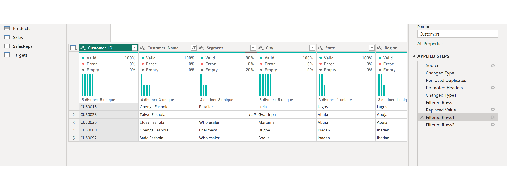 

Also, the `customers` table has a name inconsistency in the `region` column. There are instances of `lagos` and `Lagos`. 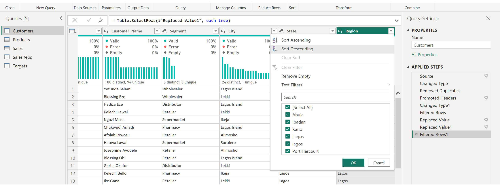

**Resolution:** replaced the `lagos` value with `Lagos`, to ensure consistency with other named regions. 

The `products` table, the `product_name` column contains rows with whitespaces disrupting the same text; e.g., Power Horse 250ml 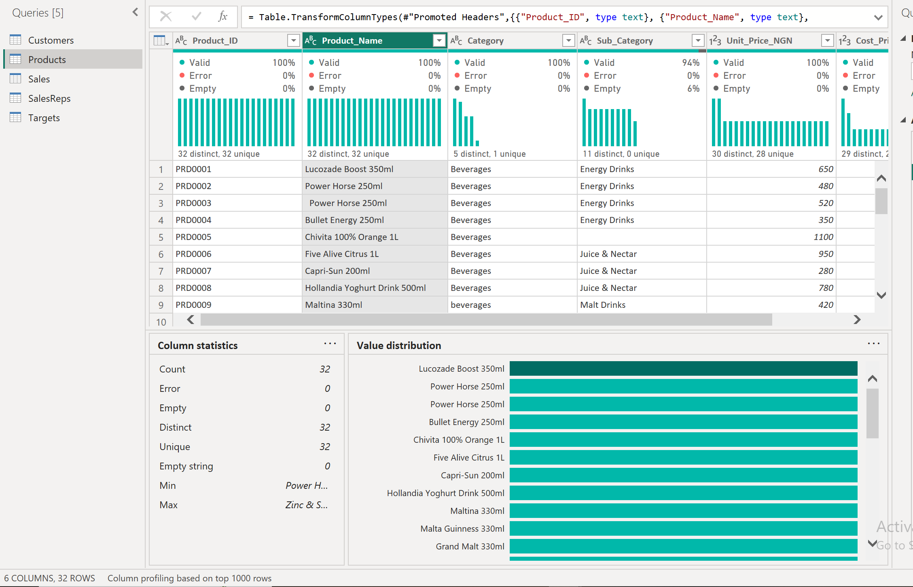

**Resolution**: removed the unnecessary whitespaces.
 
The `products` table, the `sub_category` column contain 6% empty strings; the empty rows don’t give the `category`. This can be researched and filled since it is only two rows. 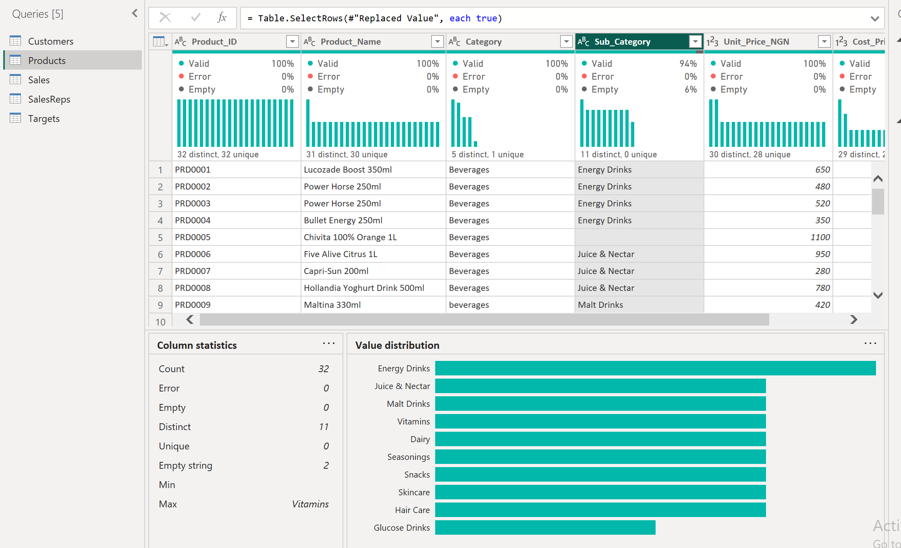

**Resolution**: Based on research, in the FMCG industry, Chivita 100% Orange 1L and Ribena Blackcurrant 300ml fall primarily under the `Beverages` and `Health and Wellness` categories, respectively, but they are both sub-categories of `Juice & Nectar`.  Therefore, the empty strings were replaced with `Juice & Nectar`.

In the `products` table, the `category` column has a name inconsistency with `Beverages` 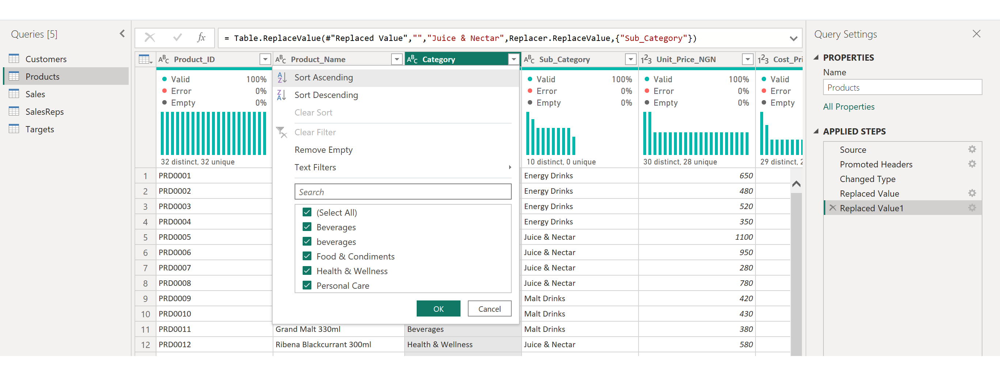

**Resolution:** replaced the `beverages` with `Beverages` to ensure naming consistency.

In the `products` table, the `unit_price_NGN` column was also analysed using the `Groupby` method to identify the duplicated unit prices: 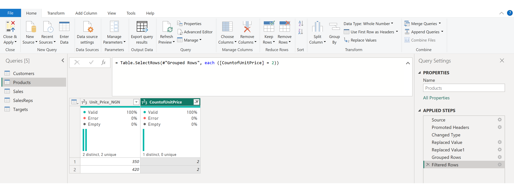
However, the product names were different, suggesting different values in unit_prices.

Similarly, `cost_price_NGN` contains duplicate values, as the number of distinct values exceeds the number of unique values. It was also analysed using the `Groupby` method to identify the duplicated unit prices, also suggesting different values in unit_prices. 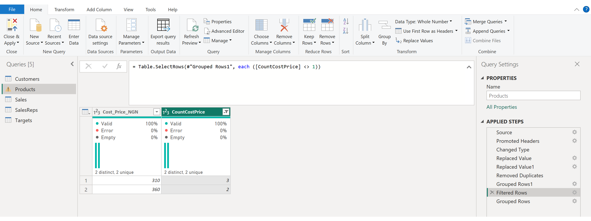

In the `sales` table, the `order_ID` column was also analysed using the `Groupby` method to identify the duplicated ids: 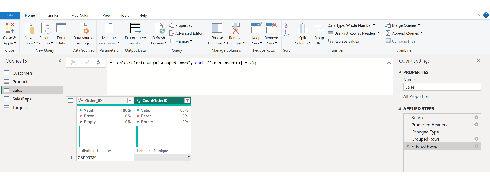

The order id `ORD00780` appeared twice. This shows duplication of the order by an individual, as shown below: 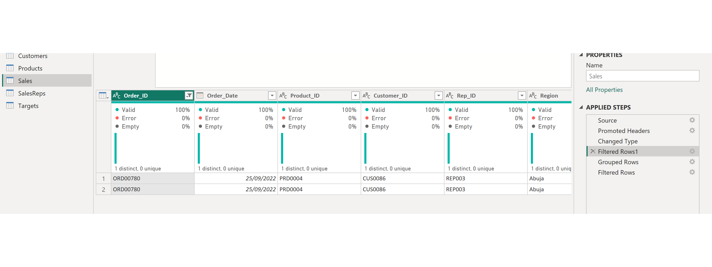

**Resolution**: removed duplicates from the customer_id row.
 
In the Sales table, the `unit_sold` indicates the number of products sold; having a null value here is not appropriate. Since only one row is `null`, we can replace the value with `0`.

Also, in the Sales table, the `region`column contains inconsistent naming, with `PH` and `Port Harcourt` 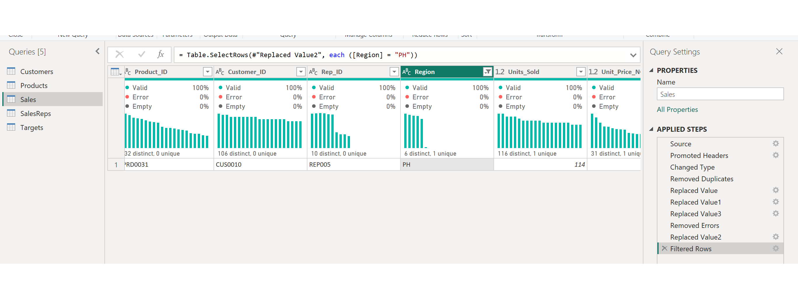

**Resolution:** ensured consistency by retaining `Port Harcourt`, since the other regions were named in full. E.g., Lagos, Abuja.

In the Sales table, the `unit_price` indicates the cost for buying a unit of a product; having a null value here is not appropriate. Since only one row is `null`, I decided to use the average cost by region (Kano) for the product based on the sales table, which is `821`. 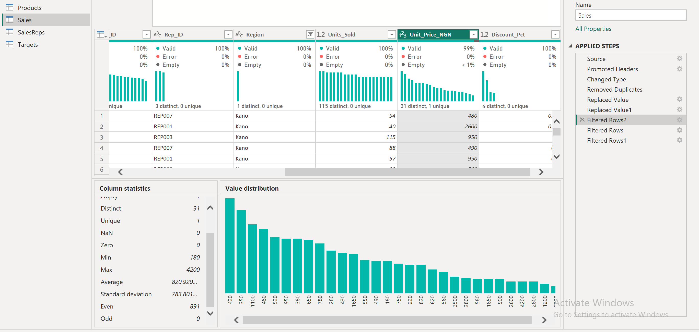

The `discount_pt` column contains an error in the row. The error was removed. 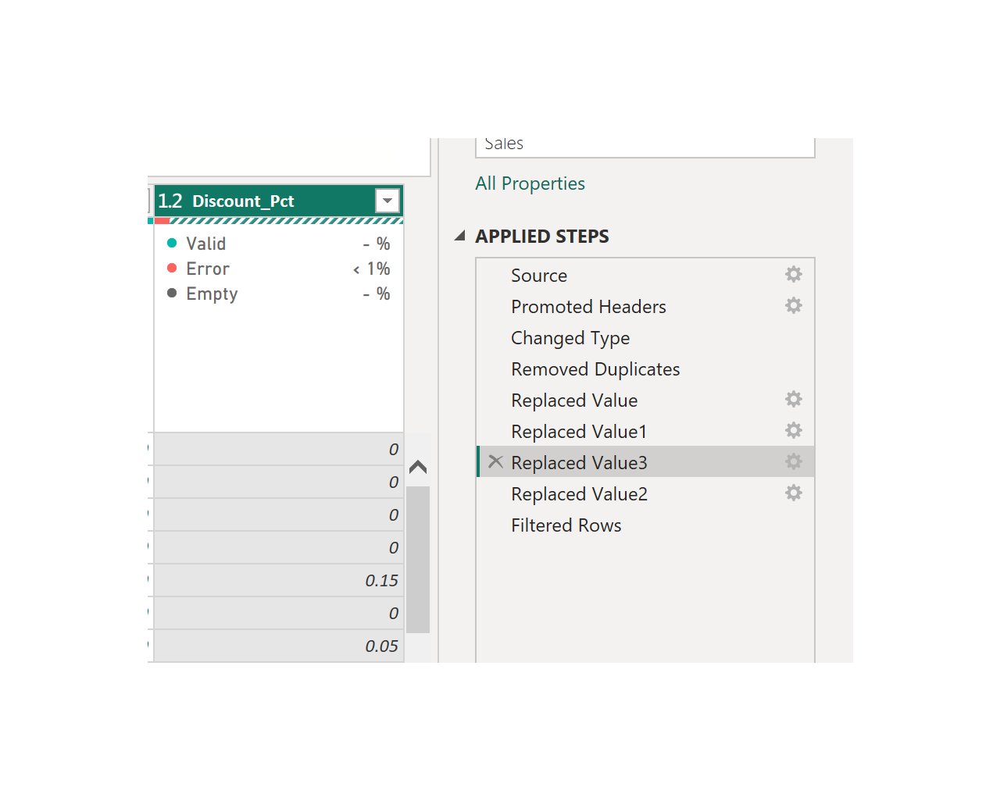

The pattern in the `salesreps` table shows that each `manager` was simultaneously attached to their representatives; therefore, `Musa Bello` should be the manager of `Sule Maikano` 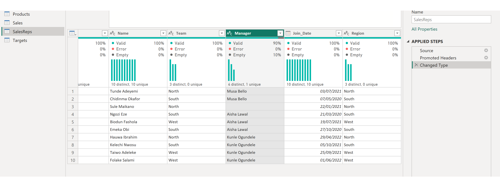

Unpivoting the `targets` table from wide format (months as columns) to long format (one row per month-region combination). 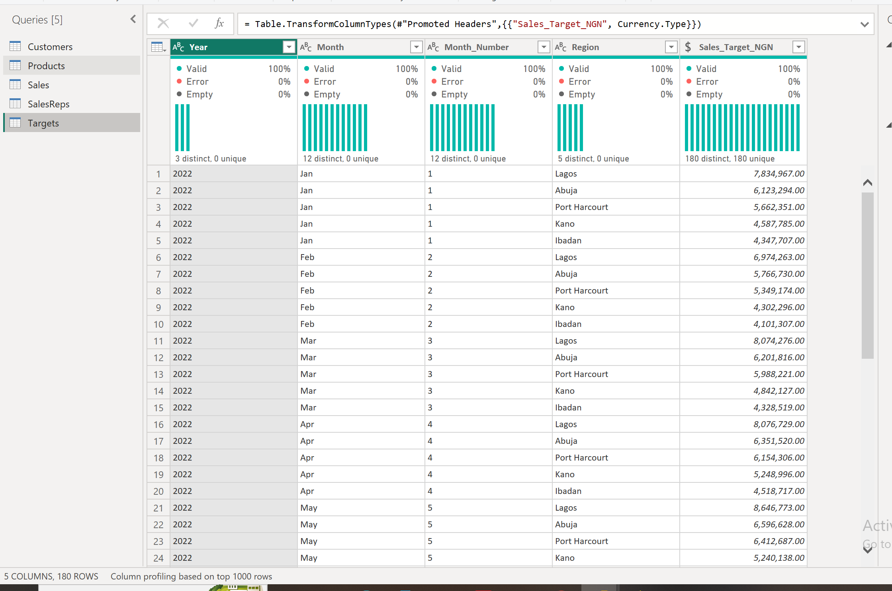

Created a Date Dimension table using DAX with includes the `Year`, `Month Number`, `Month Name`, `Quarter`, and `Week Number`. After which it was marked as a date table. The columns are as shown below: 

Built a Star Schema: `Sales` (Fact) connected to `Products`, `Customers`, `SalesReps`, `Targets`, and `Date` (all Dimension/Reference tables) and verified the correct relationship cardinality (one-to-many) and filter direction on every relationship. 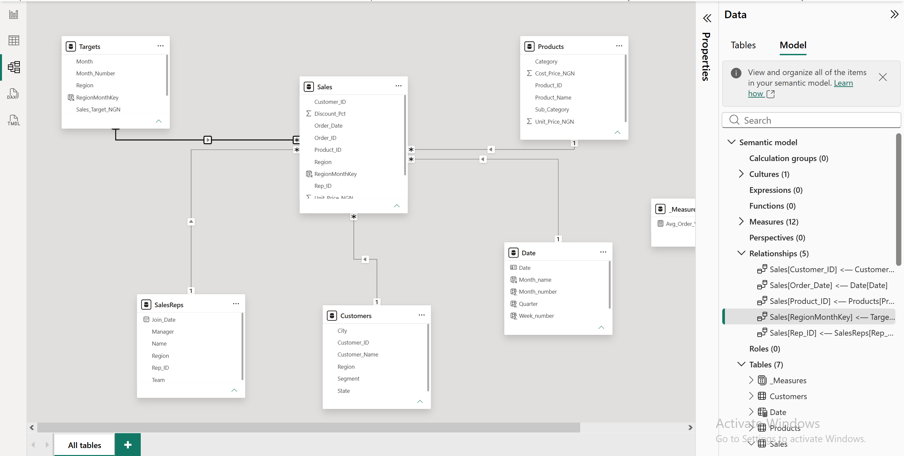

The `targets` and `sales` tables do not have a matching column to create a working relationship. Therefore, I created a matching key on each side, then relate on that key.

**Resolution**: I added a column on `sales` that matches the same format as `targets`: `Year_Month = Text.From(Date.Year([Order_Date])) & "-" & Text.From(Date.Month([Order_Date]))`

And also created a composite key column on both tables:

On Sales:
`RegionMonthKey = Sales[Region] & "|" & Sales[Year_Month]`
 
On Targets:
`RegionMonthKey = Targets[Region] & "|" & Targets[Year_Month]`

## **3.2  DAX Measures**
Created a dedicated Measures Table (an empty table named `_Measures`), which contained all measures in the data model inside it.

<table>
  <tr>
   <td>
<strong>Measure Name</strong>
   </td>
   <td>
<strong>Business Logic</strong>
   </td>
   <td>
<strong>DAX Concept Required</strong>
   </td>
  </tr>
  <tr>
   <td>
<strong>Total Revenue</strong>
   </td>
   <td>
SUMX(Sales, Sales[Units Sold] * Sales[Unit Price] * (1 - Sales[Discount %]))
   </td>
   <td>
<strong>SUMX</strong>
   </td>
  </tr>
  <tr>
   <td>
<strong>Total Cost</strong>
   </td>
   <td>
SUMX(Sales, Sales[Units Sold] * RELATED(Products[Cost Price]))
   </td>
   <td>
<strong>SUMX + RELATED</strong>
   </td>
  </tr>
  <tr>
   <td>
<strong>Gross Profit</strong>
   </td>
   <td>
Total Revenue minus Total Cost (measure reference)
   </td>
   <td>
<strong>Measure reference</strong>
   </td>
  </tr>
  <tr>
   <td>
<strong>Gross Profit %</strong>
   </td>
   <td>
DIVIDE(Gross Profit, Total Revenue, 0)
   </td>
   <td>
<strong>DIVIDE</strong>
   </td>
  </tr>
  <tr>
   <td>
<strong>Total Orders</strong>
   </td>
   <td>
DISTINCTCOUNT(Sales[Order ID])
   </td>
   <td>
<strong>DISTINCTCOUNT</strong>
   </td>
  </tr>
  <tr>
   <td>
<strong>Avg. Order Value</strong>
   </td>
   <td>
DIVIDE(Total Revenue, Total Orders, 0)
   </td>
   <td>
<strong>DIVIDE</strong>
   </td>
  </tr>
  <tr>
   <td>
<strong>YTD Revenue</strong>
   </td>
   <td>
TOTALYTD(Total Revenue, Date[Date])
   </td>
   <td>
<strong>TOTALYTD / DATESYTD</strong>
   </td>
  </tr>
  <tr>
   <td>
<strong>Revenue LY</strong>
   </td>
   <td>
CALCULATE(Total Revenue, SAMEPERIODLASTYEAR(Date[Date]))
   </td>
   <td>
<strong>SAMEPERIODLASTYEAR</strong>
   </td>
  </tr>
  <tr>
   <td>
<strong>YoY Growth %</strong>
   </td>
   <td>
DIVIDE(Total Revenue - Revenue LY, Revenue LY, 0)
   </td>
   <td>
<strong>Time Intelligence chain</strong>
   </td>
  </tr>
  <tr>
   <td>
<strong>Target Achievement %</strong>
   </td>
   <td>
DIVIDE(Total Revenue, SUM(Targets[Sales Target]), 0)
   </td>
   <td>
<strong>DIVIDE + CALCULATE</strong>
   </td>
  </tr>
  <tr>
   <td>
<strong>Revenue excl. Region Filter</strong>
   </td>
   <td>
CALCULATE(Total Revenue, ALL(Customers[Region]))
   </td>
   <td>
<strong>ALL</strong>
   </td>
  </tr>
  <tr>
   <td>
<strong>Region Revenue Share %</strong>
   </td>
   <td>
DIVIDE(Total Revenue, [Revenue excl. Region Filter], 0)
   </td>
   <td>
<strong>ALLEXCEPT pattern</strong>
   </td>
  </tr>
</table>

The measures were created using the formulas provided above in the table, and the output is as shown below: 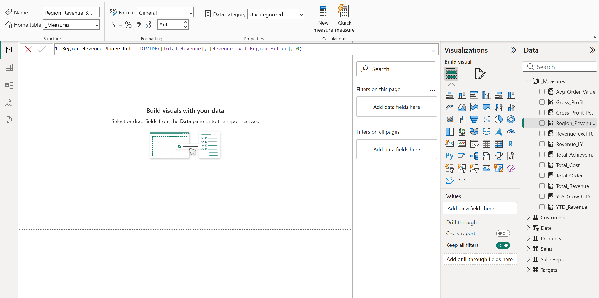

## **3.3  Report Pages & Visuals**
The report contains exactly five pages. The fifth covers EDA and AI-driven analysis.

### **Page 1 — Executive Summary**
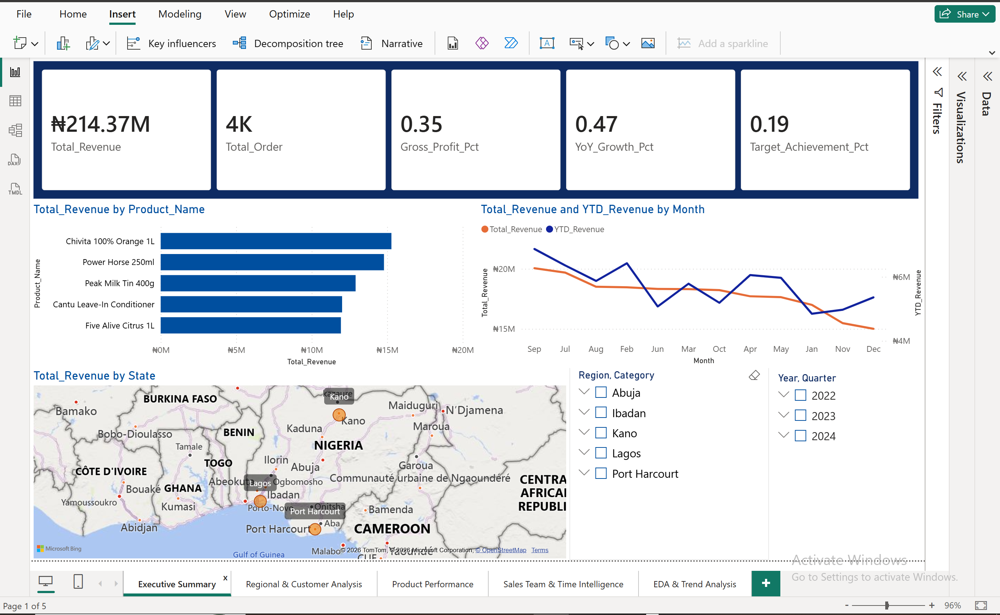

    ● KPI Cards: Total Revenue, Total Orders, Gross Profit %, YoY Growth %, Target Achievement %

    ● Line chart: Monthly Revenue Trend (with YTD line overlay as a secondary measure)

    ● Bar chart: Top 5 Products by Revenue

    ● Map visual: Revenue by State (use the map visual or filled map)

    ● Slicer panel: Year, Quarter, Region, Product Category

    ● Apply report-level, page-level, and visual-level filters appropriately

**Key Findings:**
1. `Total revenue` across the full dataset stands at N214.37M, generated from approximately 4,000 orders.
2. `Overall Gross Profit %` is 0.35 (35%), indicating a healthy blended margin across all product `categories` and `regions`.
3. `YoY Growth %` is 47%, showing strong year-over-year revenue expansion at the portfolio level.
4. `Target Achievement %` is only 19%, the most concerning metric on this page. Despite positive YoY growth, `actual revenue` is tracking well below the assigned targets, suggesting that the targets may have been set aggressively or only a small slice of target periods/regions are being met.
5. **Chivita 100% Orange 1L** is the top revenue-generating product, followed by **Power Horse 250ml and Peak Milk Tin 400g**.
6. The `Total Revenue` vs `YTD Revenue` line chart shows `YTD Revenue` (blue) oscillating above and below the `Total Revenue` (orange) trend line, with `YTD` pulling notably ahead mid-year before converging downward toward December, consistent with cumulative `YTD` compared against a per-period actual.
7. The map visual confirms five active regions (Abuja, Ibadan, Kano, Lagos, Port Harcourt), with each represented on the Nigeria map.

**Methodology Decisions:**
1. `Total_Revenue`, `Total_Order`, `Gross_Profit_Pct`, `YoY_Growth_Pct`, and `Target_Achievement_Pct` were each built as standalone DAX measures, so they recalculate correctly under any filter/slicer context applied on this page.
2. `YTD_Revenue` uses `TOTALYTD()` against the Calendar `date` table to ensure accurate cumulative behaviour across month boundaries.
3. `Region` and `Category` slicers were placed on this page to let the dashboard reviewer interact with KPIs.

**Limitations:**
1. `Target_Achievement_Pct` of 19% is reported as a single blended figure on this page. However, the root cause (specific regions, months, or reps driving the shortfall) is not visible here and requires drill-down on later pages.
2. The `Year/Quarter` filter pane was unfiltered in the reviewed view, so this summary reflects the full `2022–2024` dataset and not any single period.

### **Page 2 — Regional & Customer Analysis**
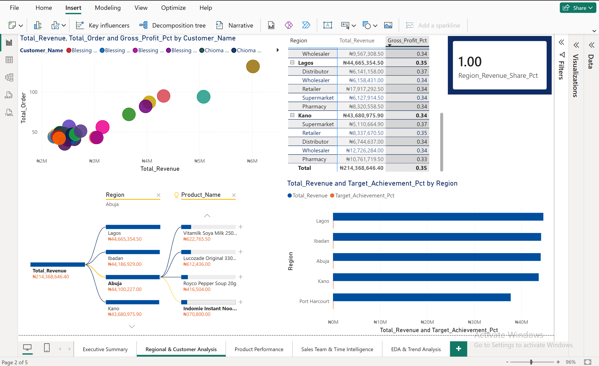

    ● Matrix: Revenue and Gross Profit % by Region and Customer Segment

    ● Scatter plot: Revenue vs Total Orders per Customer (bubble size = Gross Profit %)

    ● Decomposition Tree: Revenue broken down by Region > Category > Product — Session 17

    ● Clustered bar chart: Revenue vs Target by Region

    ● Region Revenue Share % card using the ALL-based measure

**Key Findings:**
1. `Lagos (N44.67M)` and `Abuja (N44.10M)` are the top two regions by revenue, closely followed by `Ibadan (N44.19M)` and `Kano (N43.68M)`. The four leading regions are tightly clustered within roughly N1M of each other, indicating a fairly even regional spread and not one dominant hub.
2. Within `Lagos` and `Kano`, the `Retailer` and `Wholesaler` channels consistently contribute the largest revenue share among customer segments, while `Pharmacy` tends to post the lowest `Gross_Profit_Pct (0.33–0.34)` of the listed channels.
3. The `Region_Revenue_Share_Pct` card reads `1.00` in the reviewed view, which is expected only when no single-region filter is applied.
4. The scatter plot (`Total_Revenue` vs `Total_Order`, `sized/colored` by `Customer_Name`) shows a clear positive relationship: customers with higher order counts also tend to generate proportionally higher revenue, with one standout customer near N6M revenue and ~100 orders. The decomposition tree confirms `Abuja's` largest single product contributor is **Royco Pepper Soup 20g (N416,504)**, while `Lagos's` top product is **Vitamilk Soya Milk 250ml (N622,765.50)**.
5. `Total_Revenue` and `Target_Achievement_Pct` by `Region` shows `Port Harcourt` with the longest revenue bar among the five regions in this particular view, while all regions show only a thin `Target_Achievement_Pct` marker near the `axis baseline`, reinforcing the Page 1 finding that targets are being substantially under-achieved across the board, not just in one region.
 
**Methodology Decisions:**
1. `Region_Revenue_Share_Pct` was built as the ALL-based share-of-total measure: `DIVIDE(SUM(Sales[Revenue]), CALCULATE(SUM(Sales[Revenue]), ALL(Sales[Region])), 0)`, this strips the Region filter only, preserving any other active filters (e.g., `Category`) while computing the `grand-total` denominator.
2. Customer-level scatter plot uses `Customer_Name` on the `Legend field` so that each customer gives one bubble, with `Total_Revenue/Total_Order` on `X/Y-axis`.
3. The `Region/Product_Name` matrix and decomposition tree both pull from the same underlying Sales fact table joined to `Region` and `Product` dimension tables, keeping channel-level (`Distributor/Wholesaler/Retailer/Supermarket/Pharmacy`) subtotals consistent across visuals.

**Limitations:**
1. Channel-level `Gross_Profit_Pct` figures `(0.33–0.37)` are very close to each other, so visual conditional-formatting thresholds may need fine-tuning to make meaningful color differentiation rather than uniform green shading.

### **Page 3 — Product Performance**
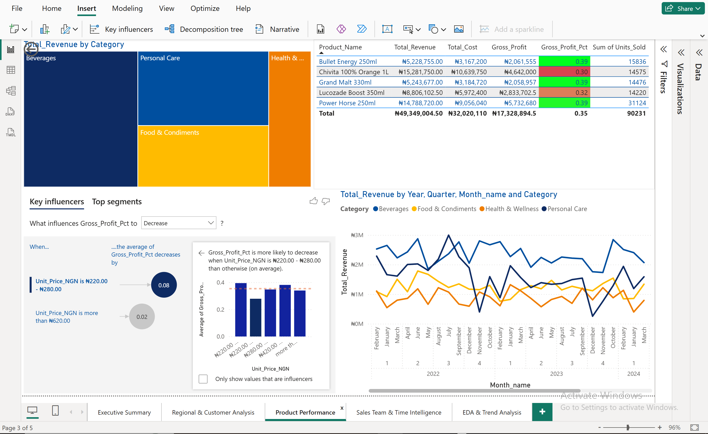

    ● Treemap: Revenue contribution by Product Category

    ● Table: Product-level detail — Revenue, Cost, Gross Profit, GP%, Units Sold — with conditional formatting on GP%

    ● Line chart: Monthly sales trend per Category (date hierarchy + drill-down from Session 3)

    ● Key Influencers visual: What factors drive high Gross Profit %? — AI visual from Session 17

**Key Findings:**
1.  Across the full product table, total `Gross_Profit_Pct` is `0.35`, with **Bullet Energy 250ml, Grand Malt 330ml, and Power Horse 250ml** each posting the strongest margin at `0.39` (shown in green), while **Chivita 100% Orange 1L lags** at `0.30` (shown in red) despite being a top revenue earner (a classic 'high volume, lower margin' product profile).
2. **Power Horse 250ml** leads in `Units_Sold (31,124 units)` by a wide margin over the next-closest product `(Bullet Energy 250ml at 15,836)`, making it the clear volume driver even though **Chivita** generates slightly more total revenue.
3. The treemap `(Total_Revenue by Category)` confirms `Beverages` as the dominant category by `revenue` and `order volume`, followed by `Personal Care`, `Food & Condiments`, and `Health & Wellness`.
4. The Key Influencers visual identifies `Unit_Price_NGN` in the `N220–N280` range as the strongest driver of a `Gross_Profit_Pct` decrease (contributing an average drop of 0.08), suggesting products priced in this band are systematically less profitable, which may be due to cost structure or discounting at that price point.
5. The multi-line revenue trend by `Category (Year/Quarter/Month)` shows `Beverages` (dark navy) consistently posted as the highest or near-highest revenue line across nearly every month from `2022–2024`, with high month-to-month volatility rather than a smooth trend.

**Methodology Decisions:**
1. Conditional formatting on `Gross_Profit_Pct` uses rule-based thresholds (red/orange/green) rather than a continuous color scale, so that reviewers can read a clear pass/fail margin signal per product rather than a gradient that's harder to interpret at a glance.
2. Key Influencers was run specifically on `'what drives Gross_Profit_Pct to Decrease'` to proactively surface margin-risk factors, complementing the `'what drives Total_Order to Increase'` analysis.

**Limitations:**
1. The page does not break out `Gross_Profit_Pct` by `Region` or `Sales Rep`, so it's not possible from this view alone to tell whether the `N220–N280` pricing/margin issue is concentrated in specific regions or spread evenly.
2. Margin analysis here is static (whole-period); no time trend of `Gross_Profit_Pct` itself is shown, only `Total_Revenue` trend by category.

### **Page 4 — Sales Team & Time Intelligence**
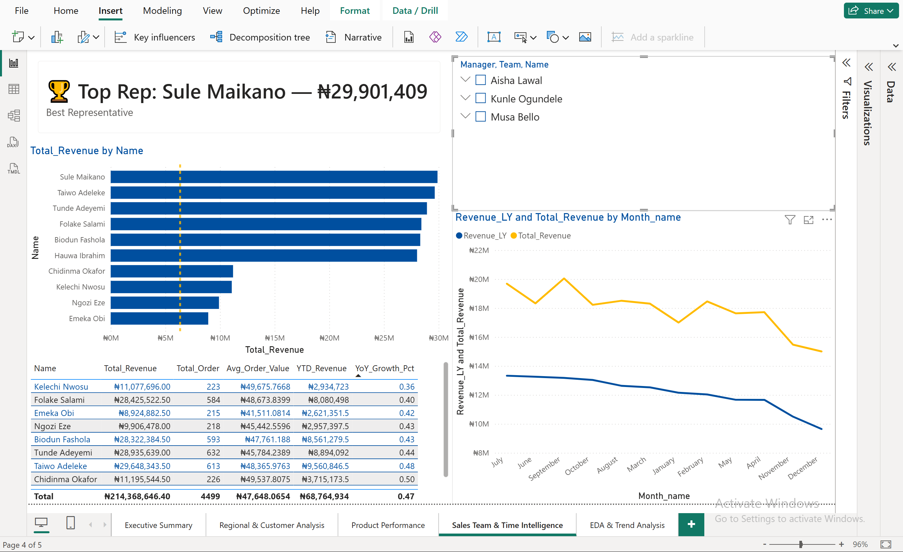

    ● Bar chart: Revenue per Sales Rep with a constant line showing the average target

    ● Table: Rep-level KPIs — Revenue, Orders, Avg Deal Size, YTD Revenue, YoY Growth %

    ● Card: Best Performing Rep (current filter context) using a dynamic DAX title measure

    ● Line chart: Revenue LY vs Current Year — dual lines showing Time Intelligence in action

    ● Slicers: Sales Rep, Manager, Team

**Key Findings:**
1. `Sule Maikano` is the top-performing sales rep with `N29,901,409` in revenue, narrowly ahead of `Taiwo Adeleke (N29,648,343.50)` and `Tunde Adeyemi (N28,935,639)`; the top three reps are tightly bunched, while a second tier `(Chidinma Okafor, Kelechi Nwosu, Ngozi Eze, Emeka Obi)` trails noticeably below the `N12M` mark.
2. `YoY_Growth_Pct` is inversely related to revenue rank in this table: lower-revenue reps like `Chidinma Okafor (0.50)` and `Taiwo Adeleke (0.48)` show the highest YoY growth, while it's not the very top-revenue reps showing the fastest growth, suggesting newer or smaller-book reps are growing off a lower base, a common and expected pattern.
3. The `Revenue_LY` vs `Total_Revenue` line chart shows current-year revenue (gold) consistently and substantially above last year's revenue (navy) across nearly every month, visually confirming the portfolio-level YoY growth reported on Page 1; though both lines trend gently downward toward the most recent months shown (November/December), which warrants attention.
4. `Total team Avg_Order_Value` sits at `N47,648.07`, with individual reps ranging from `N41,511 (Emeka Obi) to N49,675 (Kelechi Nwosu)`; a relatively narrow spread, suggesting deal sizing is fairly consistent across the team rather than driven by a few large-ticket reps.
5. The Manager hierarchy `(Aisha Lawal, Kunle Ogundele, Musa Bello)` is set up as a collapsible Manager > Team > Name slicer, enabling drill-down from manager oversight down to individual rep performance.

**Methodology Decisions:**
1. `Best Performing Rep / dynamic card` title was built using a `TOPN(1, ALL(SalesRep[RepName]), [Revenue], DESC)` pattern wrapped in `CALCULATE(SELECTEDVALUE(...))` so the trophy card title text dynamically updates to whichever rep is top under the current filter context.
2. `Revenue_LY` uses `CALCULATE([Revenue], SAMEPERIODLASTYEAR('Calendar'[Date]))` plotted against current `Total_Revenue` on the same chart and shared axis to visually demonstrate time intelligence rather than reporting YoY as a number-only KPI.
3. The `Manager/Team/Name` slicer was built as a single hierarchical field group (rather than three separate slicers) so the `Manager > Team > Name` nesting expands in one control, matching the organizational structure.

**Limitations:**
1. The downward tail in both Revenue_LY and Total_Revenue lines toward the most recent months (November, December) is visible but not explained by any visual on this page — it may simply reflect partial/incomplete data for the most recent period rather than a genuine decline, and should be verified against the raw date range in the model.

### **Page 5 — EDA & Trend Analysis**
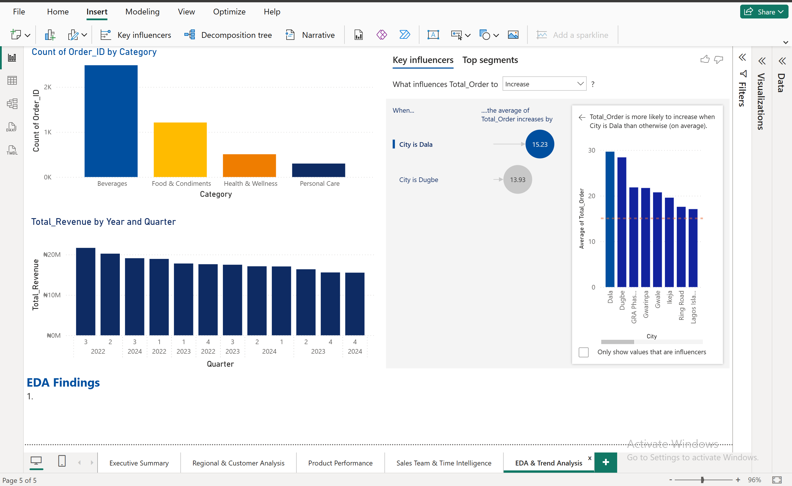

    ● Histogram: Distribution of Order Values — identify skew and outliers (Session 16)

    ● Box-and-whisker plot: Revenue distribution by Region — compare spread and medians

    ● Time series line chart: 12-month rolling revenue with trend line enabled

    ● Key Influencers visual (second instance): What drives high Total Orders? — Session 17

    ● Narrative text box: A written interpretation of the EDA findings (2–3 sentences, typed into a Power BI text box)

**Key Findings:**
1. `Beverages` dominates order volume, with nearly `2,000 orders` (almost double `Food & Condiments, which is the second-highest category)`, confirming `Beverages` as the primary driver of overall transaction activity, consistent with the Page 3 product-level finding.
2. `Total_Revenue` by `Year` and `Quarter` shows a clear declining trend, falling from a peak of roughly `N22M` in an `early quarter (2022)` to approximately `N11M` by the most recent `quarter` shown `(Q4 2024)` — a sustained downward trajectory across the full three-year window, even though `YoY_Growth_Pct` reported on Page 1 `(0.47)` is positive at the portfolio level. These two findings are not necessarily contradictory: `YoY growth` compares matched periods, while this chart shows overall quarterly revenue magnitude declining, which should be reconciled before final reporting.
3. The Key Influencers analysis identifies City is `Dala` as the strongest driver of an increase in `Total_Order`, contributing an average uplift of `15.23 orders` — notably ahead of `City` is `Dugbe (13.93)`.
4. The supporting bar chart of Average `Total_Order` by `City` confirms `Dala (~29)` and `Dugbe (~27)` as the two leading cities, while `Ring Road` and `Lagos Island` sit at the bottom of the ranking `(~16–17)` — roughly half the order volume of the top cities.

**Methodology Decisions:**
1. The Key Influencers visual was configured to analyze `'what influences Total_Order to Increase'` using `City` as a candidate explanatory field, leveraging Power BI's built-in statistical influencer algorithm rather than a manual DAX-based driver analysis, to surface non-obvious patterns quickly during EDA.
2. `Total_Revenue` by `Year` and `Quarter` was deliberately left as a flat bar chart (not broken out by category or region).

**Limitations:**
1. Key Influencers results reflect statistical association, not causation — the `Dala/Dugbe` city effect on `Total_Order` should be framed as a correlation worth investigating operationally (e.g., rep coverage, customer density), not a proven causal driver.
2. I was unable to import the box-and-whisker plot, likewise the histogram bining was an issue with my device. therefore, I improvised with the available plottings.

# **5. Submission Deliverables**

<table>
  <tr>
   <td>
<strong>#</strong>
   </td>
   <td>
<strong>Deliverable</strong>
   </td>
   <td>
<strong>Description & Format</strong>
   </td>
<td>
<strong>Submissions</strong>
   </td>
  </tr>
  <tr>
   <td>
<strong>1</strong>
   </td>
   <td>
<strong>Power BI Report File</strong>
   </td>
   <td>
.pbix file — final version. All five pages, 12 measures, and full Star Schema model included.
   </td>
   <td>
<a href="aica-capstone.pbix">aica-capstone.pbix</a>
   </td>
  </tr>
  <tr>
   <td>
<strong>2</strong>
   </td>
   <td>
<strong>Power BI Dashboard Screenshot</strong>
   </td>
   <td>
Screenshot of your dashboard.
   </td>
   <td>
<a href="dashboards/executive-summary.png">executive-summary</a>;
<a href="dashboards/regional-and-customer-analysis.png">regional-and-customer-analysis</a>;
<a href="dashboards/product-performance.png">product-performance</a>;
<a href="dashboards/sales-team-and-time-intelligence.png">sales-team-and-time-intelligence</a>;
<a href="dashboards/eda-and-trend-analysis.png">eda-and-trend-analysis</a>
   </td>
  </tr>
  <tr>
   <td>
<strong>3</strong>
   </td>
   <td>
<strong>Recorded Presentation</strong>
   </td>
   <td>
5–10 minute screen recording walking through your dashboard. Narrate your insights, not just your clicks.
   </td>
   <td>
<a href="">download here</a>
   </td>
  </tr>
  <tr>
   <td>
<strong>4</strong>
   </td>
   <td>
<strong>Written Summary (Optional +5%)</strong>
   </td>
   <td>
1-page PDF: key findings, methodology decisions, data quality issues encountered, and any limitations.
   </td>
   <td>
<a href="fmcg-summary.pdf">fmcg-summary.pdf</a>
   </td>
  </tr>
</table>

The FMCG Company Colour Codes used for the dashboard visualizations are:
0E2B63 or rgb(14,43,99); 004F9F or rgb(0,79,159); 00B1EB or rgb(0,177,235); EF7D00 or rgb(239,125,0); FFBB00 or rgb(255,187,0).

## 💡 Tools Used
- Power BI (Data Modelling, Pivot Tables, Charts and Visualizations, Filters and Conditional Formatting)
- Power Query (Data Preparation, Cleaning & Transformation)

---

## 👤 Author
**Benedict Chima Ogbulachi**  
[LinkedIn Profile] <a href="https://www.linkedin.com/in/benedictogbulachi">Benedict Ogbulachi</a>
Email Adress: benedictogbulachi@outlook.com